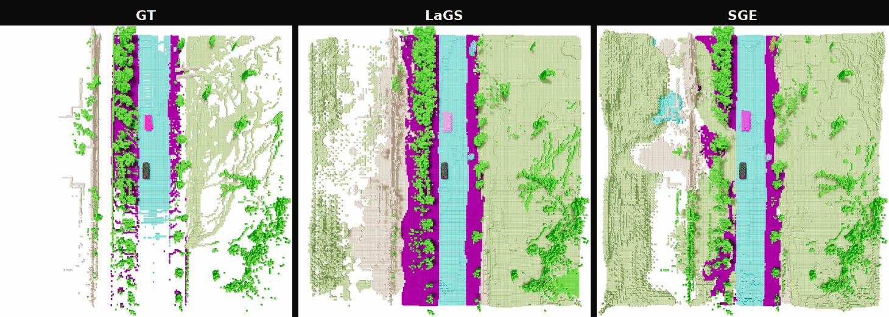

<h1 align="center">LaGS &amp; SGE</h1>

  Official implementation of Latent Gaussian Splatting (LaGS) and Streaming Gaussian Encoding (SGE), 
  two methods for camera-based 4D panoptic occupancy tracking.

  
  
  
  
  

<h3 align="center">Latent Gaussian Splatting for 4D Panoptic Occupancy Tracking</h3>

  <b>IEEE RA-L 2026</b> 
  Maximilian Luz1, Rohit Mohan1, Thomas Nürnberg2, Yakov Miron2,3, Daniele Cattaneo1, Abhinav Valada1 
  <a href="https://lags.cs.uni-freiburg.de/">Project Page</a> &nbsp;|&nbsp; <a href="https://arxiv.org/abs/2602.23172">arXiv</a>

<h3 align="center">Streaming Gaussian Encoding for 4D Panoptic Occupancy Tracking</h3>

  <b>IEEE/RSJ IROS 2026</b> 
  Maximilian Luz1, Thomas Nürnberg2, Yakov Miron2,3, Abhinav Valada1 
  <a href="https://sge.cs.uni-freiburg.de/">Project Page</a> &nbsp;|&nbsp; <a href="https://arxiv.org/abs/2606.30754">arXiv</a>

  1 University of Freiburg &nbsp;&nbsp; 2 Bosch Research &nbsp;&nbsp; 3 University of Haifa

  
   
  Qualitative nuScenes sequence: ground truth, LaGS, and SGE.

## Overview

This repository provides a camera-based framework for **4D panoptic occupancy
tracking** — jointly predicting semantic occupancy and temporally consistent
instance identities from surround-view cameras. It implements two Gaussian-based
models that turn multi-view image observations into compact latent 3D scene
representations before decoding panoptic occupancy and tracks.

### LaGS in Brief

**Latent Gaussian Splatting (LaGS)** revisits 4D panoptic occupancy tracking
through a sparse latent Gaussian scene representation. Multi-view image features
are lifted into 3D, summarized as feature-bearing Gaussian keypoints, processed
with hierarchical point-based attention, and splatted back into a dense voxel
volume for panoptic occupancy decoding. This gives the model adaptive spatial
support and long-range 3D interactions without relying only on dense voxel
operators.

### SGE in Brief

**Streaming Gaussian Encoding (SGE)** extends the Gaussian representation from
LaGS into a persistent streaming scene memory. Instead of rebuilding the
volumetric representation independently at every frame, it propagates latent
Gaussian queries with ego-motion compensation, uses opacity and confidence to
retain well-supported scene structure, and refreshes weak slots with new
observations. This adds representation-level temporal coherence, especially
through occlusion, while staying compatible with the LaGS-style decoder.

---

  
    
  The implementation, checkpoints, configurations, and documentation will be released here.

